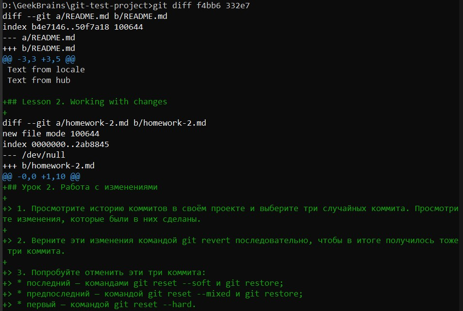
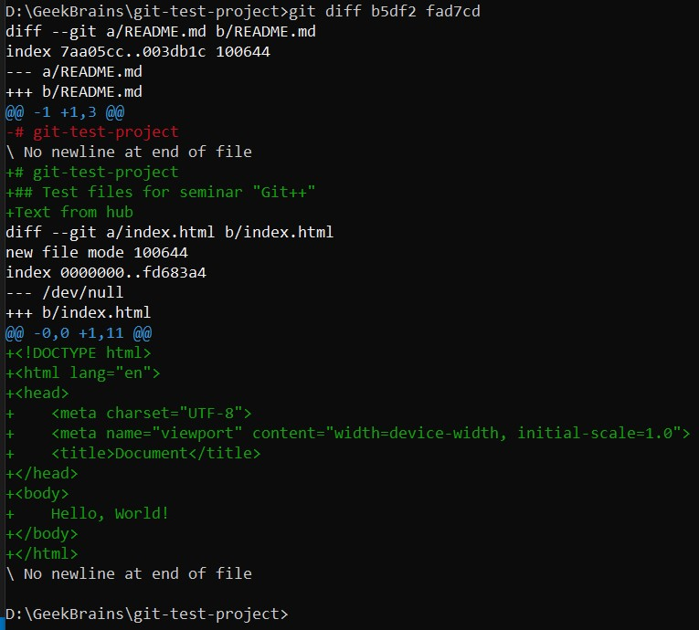
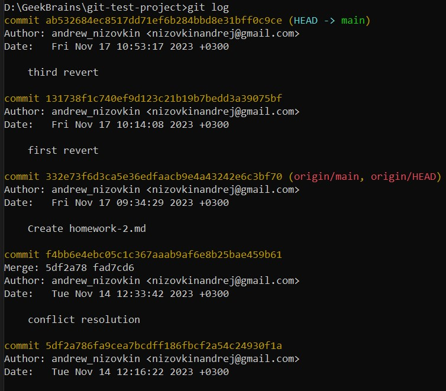
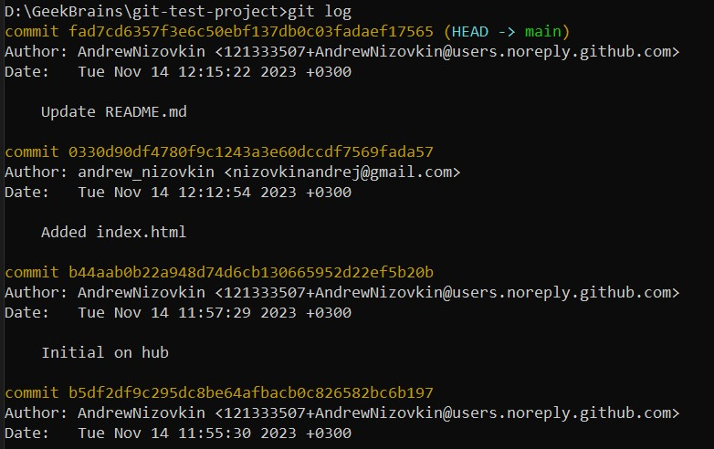

## Урок 2. Работа с изменениями

> 1. Просмотрите историю коммитов в своём проекте и выберите три случайных коммита. Просмотрите изменения, которые были в них сделаны.

_Смотрим историю коммитов и сравниваем последние три для файла README.md:_

```
git log

git diff f4bb6 332e7

```



```
git diff b5df2 fad7cd
```




> 2. Верните эти изменения командой git revert последовательно, чтобы в итоге получилось тоже три коммита.

_Последовательно возвращаем изменения, устраняя возникающие конфликты:_

```
git revert 5df2a7
git revert fad7cd6
git revert b44aa

git log
```




> 3. Попробуйте отменить эти три коммита:
> * последний — командами git reset --soft и git restore;
> * предпоследний — командой git reset --mixed и git restore;
> * первый — командой git reset --hard.

```
git reset --soft 131738f1c740ef9d123c21b19b7bedd3a39075bf
git restore --staged README.md
git restore README.md

git reset --mixed 332e73f6d3ca5e36edfaacb9e4a43242e6c3bf70
git restore README.md

git log

```

